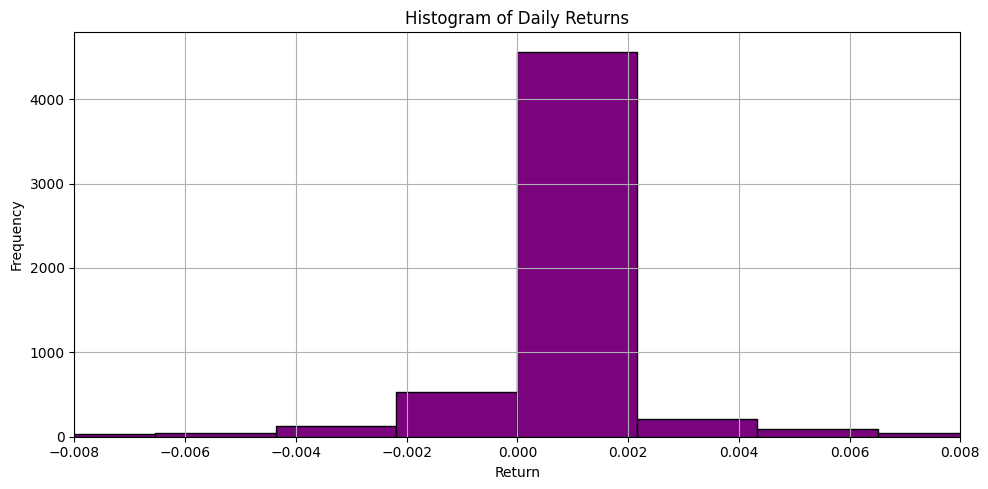

# Trading Strategy using Stack Ensemble

This is a passion project that implements a machine learning-driven trading strategy that leverages financial technical indicators and model confidence scoring to make dynamic position-sizing and trade decisions. It combines traditional technical analysis, feature engineering, model stacking, and backtesting to evaluate performance.

---

## 🛠️ 1. Feature Engineering

Feature engineering focuses on combining **price-based**, **volume-based**, **momentum**, and **volatility**, which are essential to help the models differentiate bullish vs bearish market regimes and inform prediction strength.

### ✅ Included Features:
- **Trend Indicators:**
  - `SMA_20`: 20-day Simple Moving Average
  - `EMA_50`: 50-day Exponential Moving Average
- **Momentum Indicators:**
  - `RSI_14`: 14-day Relative Strength Index
  - `STOCH_K`: Stochastic Oscillator %K
  - `MACD_Line` & `MACD_Signal`: MACD trend momentum crossover
- **Volatility Indicators:**
  - `ATR_14`: Average True Range
  - `BB_percent`: Bollinger Band % position
- **Volume & Price Dynamics:**
  - `OBV`: On-Balance Volume
  - `Volume_pct_change`: Daily % change in volume
  - `Return_1d`: Daily return
- **Custom Features:**
  - `MACD_crossover`: Bullish signal when MACD crosses above signal line
  - `Breakout_SMA20`: Binary flag for price > SMA
  - `Vol_Return_Interaction`: Price-volume interaction
  - `ATR_spike`: Volatility surge
  - `Bullish_Trend`: Indicates short-term trend strength (SMA > EMA)

### ❌ Excluded:

We exclude lagging price values (`Close`, `Close_Lag1`, `Close_Lag2`, etc.) and future prices to avoid data leakage and target leakage.

---

## 🤖 2. Model Training Pipeline

The strategy trains two distinct models for different regimes:
- **Bullish**: Stacked Ensemble (XGBoost + Ridge → Logistic Regression)
- **Bearish**: XGBoost Only

### a. XGBoost with Optuna Hyperparameter Tuning
- TimeSeriesSplit cross-validation ensures time-order integrity.
- Feature selection is done using `SelectFromModel` to retain only the most relevant features.
- Targets are filtered to only include days with meaningful movement (>0.5%).

### b. Stacked Model
For bullish regimes, we combine:
- **Base Models**: XGBoost and RidgeClassifier
- **Meta Model**: Logistic Regression
- Stacking improves generalisation, especially in stronger upward trends.

### Why this configuration?
- `XGBoost` captures **complex nonlinear patterns**, decision thresholds, and interactions.
- `RidgeClassifier` complements with **linear bias**, helping to model straightforward relationships and adds **diversity** to the ensemble.
- `LogisticRegression` as meta-model works well on probability scores from base learners and provides a **calibrated, interpretable decision boundary**.
- The ensemble **boosts generalisation** in bullish regimes, which typically exhibit smoother uptrends.

### Why Not Use Stack for Bearish?
- Bearish periods are often **more volatile**, where XGBoost already performs well alone.
- Stacking was **consistently lowering model's performance** during bearish backtests.
- To avoid overfitting and unnecessary complexity, **we rely on a simpler XGBoost model** for bearish regimes.

---

## 📈 3. Trading Strategy

### a. Probability Scoring
Each model outputs a **probability score** (i.e. confidence) that is used for:
- **Position sizing**: Higher confidence = larger position
- **Thresholding**: Entry signals must exceed a Median Absolute Deviation (MAD-based) threshold for action

### b. Buy/Exit Strategy

**Buy Logic:**
- Only when not in position
- Requires bullish probability > dynamic threshold
- Sizing scaled by confidence
- Cash is > 0

**Exit Strategy (when in position):**
1. **Take profit**: +5% gain → scale out 30%
2. **Bearish signal**: Partial/full exit depending on severity
3. **Trailing stop**: 3% drop from peak
4. **Hard stop-loss**: 5% from entry

**Cash is updated properly**, and safeguards are added to prevent overspending or selling more than held.

---

## 📉 4. Backtesting & Evaluation

- Full portfolio value tracked over time
- Daily returns histogram
- Comparison against **S&P 500** and **Apple stock (AAPL)**
- Final metrics:
  - Annualised return (CAGR)
  - Buy/sell attempts
  - Final portfolio value

---

## Data Visualisation of Strategy Performance

### Final Portfolio Summary
  

---

### Buy/Sell Triggers
  

---

### Strategy vs Benchmark (S&P 500)
  

---

### Histogram of daily returns
  

---

### Market exposure vs available cash
  

---

## Further Improvements (Planned or Future Scope)

1. **Leverage, Perpetuals & Options**  
   - Extend bearish-side strategies by integrating derivatives for hedging or magnifying returns.  
   - For instance, use inverse ETFs or short-selling logic during high-confidence bearish periods.

2. **Multi-Asset Support**  
   - Extend model to handle a basket of equities instead of a single stock (e.g. AAPL).  
   - Explore diversification and cross-signal interactions across different tickers or sectors.

3. **Real-time Inference Pipeline**  
   - Wrap model predictions and signal generation into a real-time API or trading bot framework using FastAPI or Streamlit.

4. **Risk-Adjusted Metrics & Position Scaling**  
   - Incorporate Sharpe Ratio, Maximum Drawdown, and exposure limits into performance tracking and position control.

---
